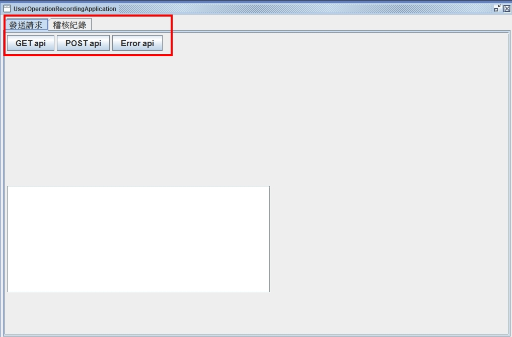
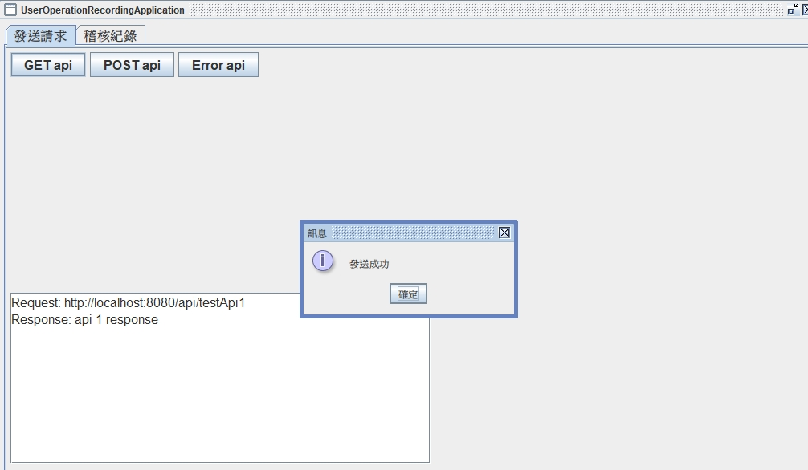
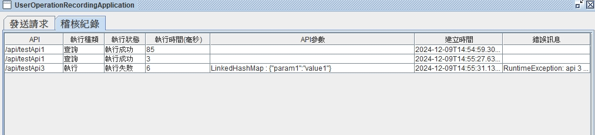

# 使用者操作稽核記錄系統

## 公共程式描述

追蹤使用者在系統中的操作行為。該系統能夠即時捕捉並儲存重要的操作資訊，包括登入登出、資料查詢、修改、刪除及其他關鍵性操作，確保數據透明性與行為可追溯性。

透過靈活的報表生成功能，管理者可快速檢視特定使用者或時間範圍內的操作記錄，輕鬆應對內部稽核需求與法規遵循。

## 內含功能

- 使用者行為追蹤
- 操作稽核報表

## 使用技術

- Spring Boot
- Spring Data JPA
- Hibernate
- H2 Database

## 使用之弱點掃描工具

Fortify SCA

## 授權方式

MIT

## 使用案例

行政院公共工程委員會
「公共工程雲端系統資訊服務案」之公共工程雲端系統

## 安裝指南

請確保您的環境中安裝有 Java 17 、 Maven 3 以上版本

```bat
# 執行步驟
> mvn clean package
> java -jar target/user-operation-recording-module-0.0.1-SNAPSHOT.jar
```

## 結果展示

> 透過發送請求頁籤模擬使用者操作<br/>


> > 請求結果顯示於下方<br/>


> 系統紀錄操作紀錄<br/>
